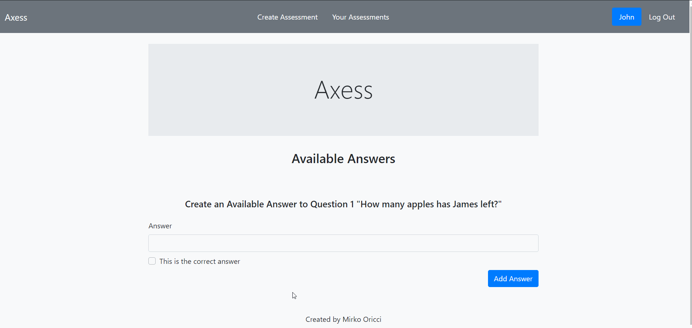
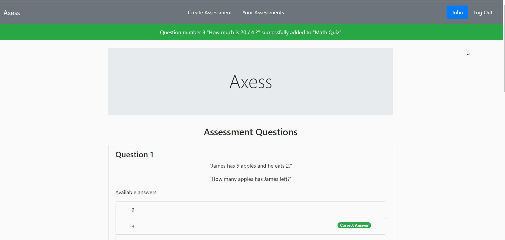
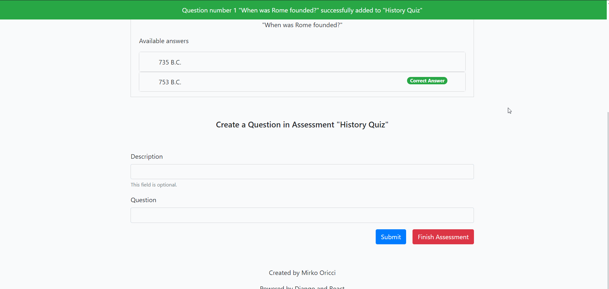

# Axess
Create and carry out assessments

# Description
This website project aims to create a one page online application that allows users to register as a "Teacher" or a "Student". 

As a "Teacher", a person shoul be able to create assessments and review all the previously created ones, as well as delete any of them. 
 As a "Student", a user should be allowed to find a given assessment, carry it out, and once submitted, be presented with the final score.

The project is subdivided in two main directories: frontend (written in React), and backend (written in Django).

# Teacher Side Use Cases

## Create Assessment
An assessment is a collection of questions (at least one), the relative available answers (at least two), and only one correct answer to a given question.

1. In order to create an assessment a techer has to click on the `create assessment` link inside the navbar at the top of the page.

2. Give the assessment a title and click the `submit` button.

3. Now add a question and, if needed, a short description.

4. Add at least two answers, one of wich must be the correct one. The correct answer can be easily selected by ticking the `is correct answer` checkbox underneath the answer input field. Once all the answers have been created, click on the `create new question` button.

5. You can add other questions and answers. Once you are done, click on the `finish assessment button` and the assessment will be added to the database. Also, the user will be displayed an assessment summary and a greee `create new assessment` button wich redirect the user to the assessment title form. 

N.B. Next to the assessment title in the summary, the assessment ID is displaied. This is can be given by the teacher to any student required to carry out the assessment. In fact, once a student has requstered an student account, he/she will be allowed to find an assessment by typing the ID in the search box (this functionality is provided on the "student side" of the website).

## Edge cases

#### No description given to a question
When creating a question, the description field is optional. In fact, if no description is given, the question is still being added to the assessment.

#### Trying to create a question with no answers
If the user tries to submit an empty answer, the answer is not created and the user will be informed about the problem by a small text beneath the input field.

#### Trying to finish a question with only one answer
If the user tries to finish a question with only one available answer, the question will not be created and the user will be informed of the problem by a message bar on the top of the page.

#### Trying to finish a question with no correct answer.
If the user tries to finish a question with no correct answer, the question will not be created and the user will be informed of the problem by a message bar on the top of the page.

#### Trying to finish a question with too many correct answer
If a user tries to finish a question with more than one correct answer, the question will not be created and the user will be informed of the problem by a message bar on the top of the page, giving a hint on how many answers he/she should delete.

An answer can be deleted from the answers list by clicking on the red `delete` button.
Once only one correct answer is left, the question will be created.

## View all the assessment created by the user
A teacher can view and delate any assessment he/she has created.

(N.B. At the moment the authentication system has not been implemented yet so all the assessments are visible, independently by who has created them).

1. Click on the `your assessments` button inside the navbar at the top of the page, and the assessments list will be displayed.

2. To view an assessment details, simply click on the assessment name.

## Delete an assessment from the list
An assessment can be easily deleted by clicking the `delete` button next to the assessment name inside the list.

# Project State
At the moment, the Teacher side of the project has been implemented through a first iteration, giving a first prototype of the final result. The next step will be to implement the Student side, and finally an authentication system.

# Installation
In order to test the current product, the steps to follow are hereafter:

1. Click on the "Clone or download" button.
2. From the popup, click on "Download ZIP".
3. As soon as the zip file has been downloaded, right-click on it and select "Extract to Axess-master\".
4. Now open the folder in a Code Editor.
5. Open a terminal and navigate to the "api" directory (e.g. `cd Axess-master/backend/api`).
6. Run the database migrations by typing `python manage.py migrate`.
7. Run the Django development server by typing `python manage.py runserver`.
8. With this terminal open, open a new terminal and navigate to the "gui" directory (e.g. `cd Axess-master/frontend/gui`).
9. Install npm by typing `npm install`.
10. Run the React development server by typing `yarn start`.

A webpage should automatically open in your browser. You are now free to navigate the current functionalities.
