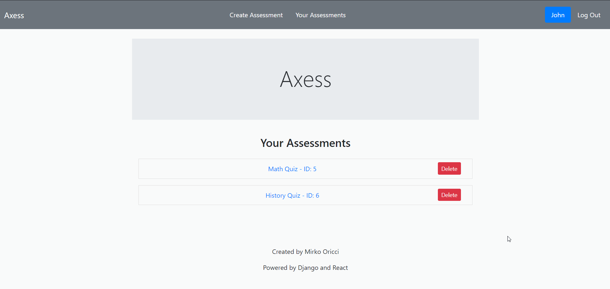
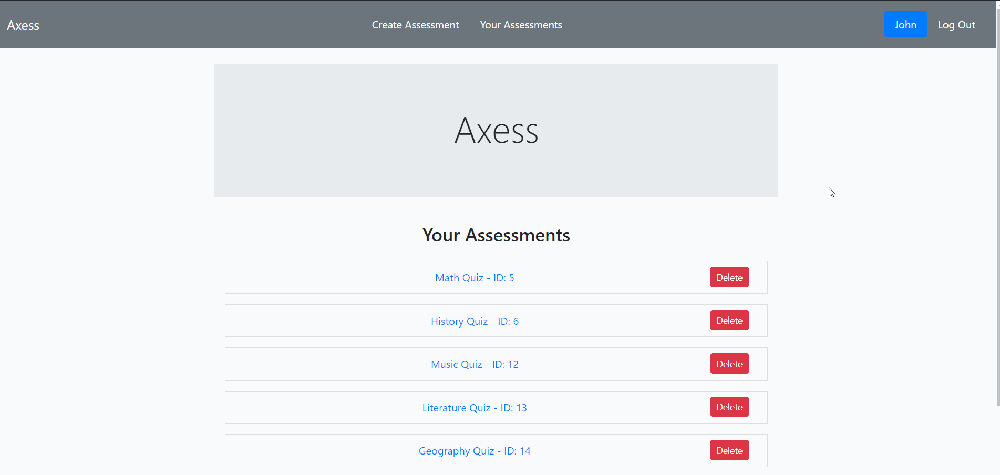
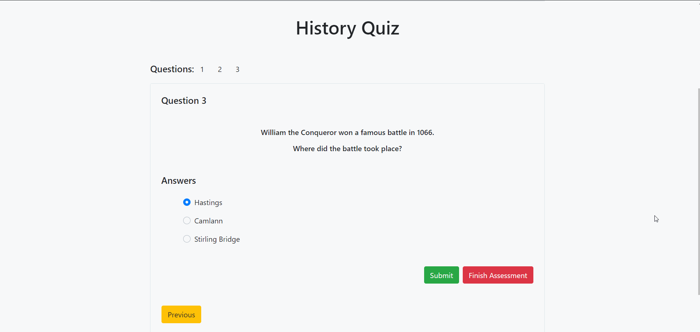

# Axess
Create and carry out assessments

# Description
This website project aims to create a one-page online application that allows users to register as a "Teacher" or a "Student". 

As a "Teacher", a person should be able to create assessments and review all the previously created ones, as well as delete any of them. 
 As a "Student", a user should be allowed to find a given assessment, carry it out, and once submitted, be presented with the final score.

The project is subdivided into two main directories: frontend (written in React), and backend (written in Django).

# Authentication

## Register
In order to access the website functionalities, a user must register and log in. Registration can be done form the homepage by clicking on the `Register` link on the right side of the navbar. The user will be prompted for credentials (username, email and password - twice to avoid typos) alongside with the role (student or teacher) and once all the details have been typed in, the form can be submitted by selecting the blue `Submit` button. The user will then automatically be logged in and informed of the successful action by a green message bar.

### Error handling

#### Missing field
If a filed detail has not been provided, a red message bar will inform the user on how to proceed.

#### Passwords provided are different
If the second password provided does not match the first one, the user will be informed of the failed submission action by a red message bar.

## Login
If already registered, a user can log in by simply clicking on the `Login` link on the right side of the navbar, and providing the credentials (username and password). He/she will be then informed of the successful action by a green message bar. Once a user has logged in, his/her username will be displayed on the right side of the navbar.

### Error handling

#### Missing field
If a field detail has not been provided, a red message bar will inform the user on how to proceed.

#### Wrong credentials provided
If the username and password provided do not match any account saved on the database, a red message bar will inform the user on how to proceed.

## Logout
To log out, a user can click on the `Logout' link on the right of the navbar and a green message bar will inform about the successful action. The user will be then prompted with the login form.

# Teacher Side Use Cases

## Create Assessment
An assessment is a collection of questions (at least one), the related available answers (at least two), and only one correct answer to a given question.

1. In order to create an assessment, a teacher has to click on the `create assessment` link inside the navbar at the top of the page.

2. Give the assessment a title and click the `submit` button.

3. Now add a question and, if needed, a short description. When finished, click the `submit` button.

4. Add at least two answers, one of which must be the correct one. The correct answer can be easily selected by ticking the `this is correct answer` checkbox underneath the answer input field. Once all the answers have been created, click on the red `create new question` button, and a green message bar will inform about the successful action.

5. You can add further questions and answers. Once you are done, click on the red `finish assessment button` and the assessment will be added to the database. Eventually, the user will be displayed an assessment summary, a green message bar informing of the successful action, and a green `create new assessment` button which redirects the user to the assessment title form, where he/she can start creating a new assessment.  

N.B. Next to the assessment title in the summary, the assessment ID is displayed. This can be given by the teacher to any student required to carry out the assessment. Once a student has registered on the website with a student account, he/she will be allowed to find an assessment by typing the ID in the search box.

### Error handling

#### No description given to a question
When creating a question, the description field is optional. If no description is given, the question is still being added to the assessment.

#### Trying to create a question with no answers
If the user tries to submit an empty answer, the answer is not created and the user will be informed about the problem by a small text beneath the input field.

#### Trying to finish a question with only one answer
If the user tries to finish a question with only one available answer, the question will not be created and the user will be informed of the problem by a message bar on the top of the page.

#### Trying to finish a question with no correct answer.
If the user tries to finish a question with no correct answer, the question will not be created and the user will be informed of the problem by a message bar on the top of the page.

#### Trying to finish a question with too many correct answer
If a user tries to finish a question with more than one correct answer created by mistake, the question will not be created and the user will be informed of the problem by a message bar on the top of the page, giving a hint on how many answers he/she should delete.

An answer can be deleted from the answers list by clicking on the red `delete` button.
Once only one correct answer is left, the question will be created.

## View all the assessments created by the user
A teacher can view and delate any assessment he/she has created.

1. Click on the `your assessments` button inside the navbar at the top of the page, and the assessments list will be displayed.

2. To view an assessment details, simply click on the assessment name.

## Delete an assessment from the list
An assessment can be easily deleted by clicking the `delete` button next to the assessment name inside the list.

# Student Side Use Cases

## Carry Out Assessment
A student can carry out an assessment, and once submitted the result will be displaied immediately.

1. In order to carry out an assessment a student has to click on the `find assessment` link inside the navbar at the top of the page, and enter the assessment ID given by the teacher.

2. The correct answer can be selected between the radio buttons, and by clicking the green `submit` button. After an answer has been submitted, the user can navigate through the other questions by clicking on the yellow `Previous`/`Next` buttons or by simply clicking on the question number.

3. Once all the questions have been answered, a red `finish assessment` button will appear next to the green `submit` button. When clicked, the assessment will be submitted and the assessment result will be displayed, informing the user of how many correct answers he/she has given out of how many questions. The result will be displayed as an integer percentage.

### Error handling

#### The ID typed is not a number
If the assessment ID provided is not a number, a red message bar will inform the user appropriately.

#### An assessment with the ID provided does not exists
If the assessment ID provided does not match any assessment ID in the database, a red message bar will inform the user that the assessment does not exists.

#### Assessment already carried out
If the assessment ID provided matches an assessment ID that has already been carried out by the ser, a red message bar will inform the user appropriately.

## View All Assessments Results

1. In order to view all the assessments carried out and the related results, a student has to click on the `Assessments Results` link in the navbar. Each result info comprises the assessment ID, the final score, and the date and time of submission.

# Installation
In order to test the current product, the steps to follow are hereafter:

1. Click on the "Clone or download" button.
2. From the popup, click on "Download ZIP".
3. As soon as the zip file has been downloaded, right-click on it and select "Extract to Axess-master\".
4. Now open the folder in a Code Editor.
5. Open a terminal and navigate to the "api" directory (e.g. `cd Axess-master/backend/api`).
6. Run the database migrations by typing `python manage.py migrate`.
7. Run the Django development server by typing `python manage.py runserver`.
8. With this terminal open, open a new terminal and navigate to the "gui" directory (e.g. `cd Axess-master/frontend/gui`).
9. Install npm by typing `npm install`.
10. Run the React development server by typing `yarn start`.

A webpage should automatically open in your browser. You are now free to navigate the current functionalities.
